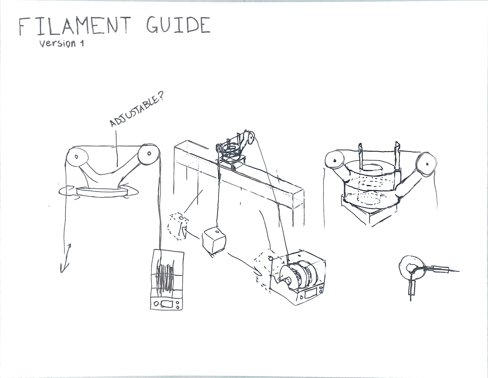

Printed the manifold in PLA because that is what was on the printer. The box runs at 50°C, PLA
starts to go soft around 55°C, and I had assumed a 5°C margin was a margin.

It is not. The manifold sagged onto the element within two hours and closed off three of the four
outlets, which meant the fourth spool got the entire airflow and the other three got nothing.

What I actually learned:

1. Glass transition is not a cliff. PLA loses stiffness well before it loses shape.
2. A part under its own weight at temperature is a different test from a part on the bench.
3. Reprinting in PETG cost two hours. Diagnosing it cost a day, because the symptom was "one
   spool dries and three don't", which looks like an airflow design problem.
